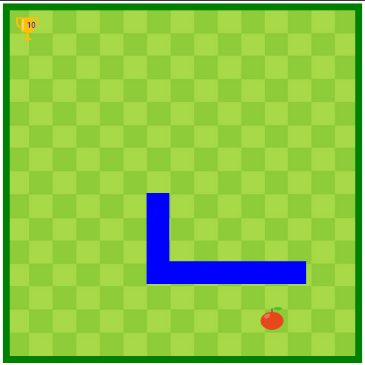
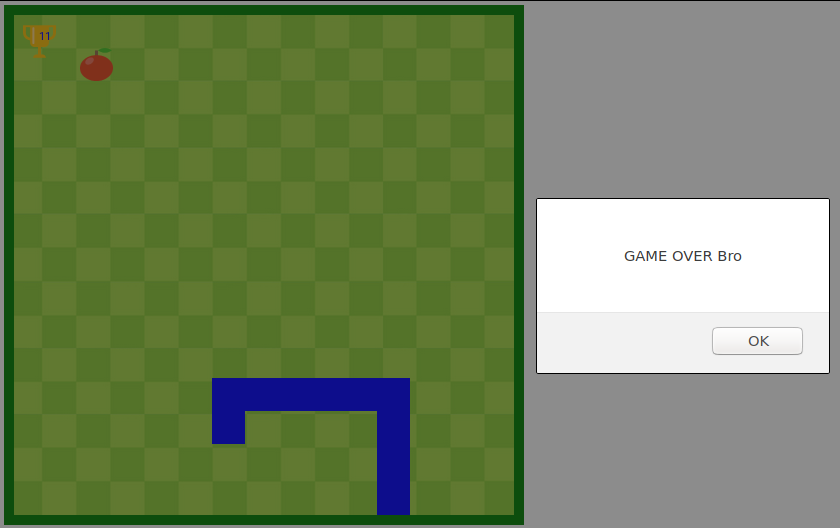

# Snake Game using Array Data Structure

Snake Game was the first game played by me in my childhood.I always wanted to create such a amazing game. I wonder how creative were developers at that time as creating this game took too much effort and logical thinking like
1. Designing board and snake
2. Making snake move according to keyboard input
3. Repeating task again and again (Game loop)
4. Boundary constraints (very imp)
5. and various other features

##Preview

## Installation

To play the game just git clone this repository on and open index.html in the browser.

## Usage
Controls
1. ArrowRight : For right movement
2. ArrowLeft : For left movement
3. ArrowUp : For upward movement
4. ArrowDown : For downward movement

